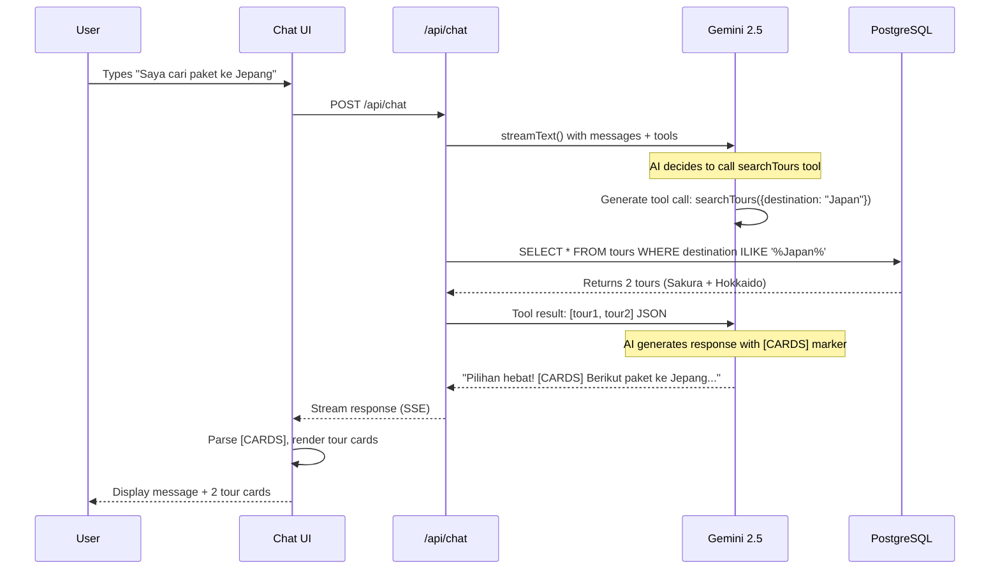
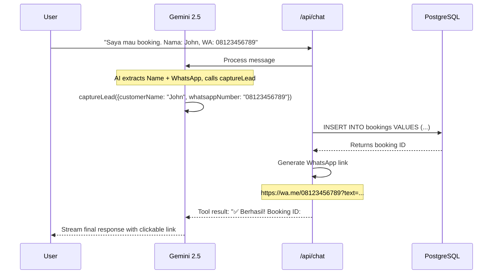

# Golden Rama Tours & Travel - System Analysis

## 📋 Overview

This document provides a comprehensive analysis of the **Golden Rama Tours & Travel** application, focusing on:
1. **Database Architecture** - PostgreSQL with Drizzle ORM
2. **AI Chatbot System** - Vercel AI SDK + OpenRouter (Gemini 2.5 Flash)

---

## 🗄️ Database Architecture

### Technology Stack
- **Database:** PostgreSQL 16 (Docker container)
- **ORM:** Drizzle ORM v0.45.1
- **Connection:** Node-Postgres (pg) pool
- **Port:** 5433 (host) → 5432 (container)

### Database Schema

The application uses **two main tables** with relational data:

#### 1. **Tours Table** ([schema.ts:19-31](file:///C:/Main%20Storage/Job/UpRev/golden_rama/Travel-Tours-AI-Chatbot-Sample/src/db/schema.ts#L19-L31))

```typescript
tours {
  id: serial (Primary Key)
  title: text (NOT NULL)
  destination: text (NOT NULL)
  price: integer (NOT NULL) // Price in IDR
  description: text (NOT NULL)
  season: seasonEnum (NOT NULL, default: "AllYear")
  tags: text (NOT NULL, default: "") // Comma-separated
  highlights: text (NOT NULL, default: "") // Comma/newline separated
  imageUrl: text
  duration: text (NOT NULL)
  createdAt: timestamp (NOT NULL, auto-generated)
}
```

**Key Features:**
- `seasonEnum`: Winter, Spring, Summer, Autumn, AllYear
- `tags`: Flexible text field for filtering (e.g., "Beach,Romance,Spa")
- `highlights`: Tour highlights stored as comma or newline-separated text
- `price`: Stored as integer in IDR (Indonesian Rupiah)

#### 2. **Bookings Table** ([schema.ts:34-41](file:///C:/Main%20Storage/Job/UpRev/golden_rama/Travel-Tours-AI-Chatbot-Sample/src/db/schema.ts#L34-L41))

```typescript
bookings {
  id: serial (Primary Key)
  customerName: text (NOT NULL)
  contactInfo: text (NOT NULL) // WhatsApp number
  tourId: integer → FOREIGN KEY to tours.id
  status: bookingStatusEnum (NOT NULL, default: "pending")
  createdAt: timestamp (NOT NULL, auto-generated)
}
```

**Key Features:**
- `bookingStatusEnum`: pending, confirmed, cancelled
- `tourId`: Foreign key relationship with tours table (optional)
- `contactInfo`: Stores WhatsApp number for lead generation

### Database Connection ([index.ts](file:///C:/Main%20Storage/Job/UpRev/golden_rama/Travel-Tours-AI-Chatbot-Sample/src/db/index.ts))

```typescript
const pool = new pg.Pool({
    connectionString: process.env.DATABASE_URL
});

export const db = drizzle(pool, { schema });
```

**Connection Flow:**
1. Uses PostgreSQL connection pool for efficient connection management
2. Drizzle ORM wraps the pool with schema awareness
3. Exported `db` instance is used throughout the app for queries

### Seed Data ([seed.ts](file:///C:/Main%20Storage/Job/UpRev/golden_rama/Travel-Tours-AI-Chatbot-Sample/src/db/seed.ts))

The application seeds **9 pre-configured tour packages** covering:
- Winter tours (Europe, Hokkaido, Dubai)
- Spring tours (Japan Sakura)
- Summer tours (New Zealand)
- Autumn tours (Turkey)
- All-year tours (Bali, Maldives, Korea)

**Seed Process:**
```bash
npm run db:seed → tsx src/db/seed.ts
```

1. Deletes all existing tours
2. Inserts 9 sample tour packages
3. Each package includes bilingual descriptions (English + Indonesian)

---

## 🤖 AI Chatbot System

### Architecture Overview

The chatbot uses a **streaming AI architecture** with tool calling capabilities:

```
User Input → Frontend (chat-window.tsx)
    ↓
POST /api/chat → Backend (route.ts)
    ↓
Vercel AI SDK → OpenRouter API (Gemini 2.5 Flash Lite)
    ↓ (with tools)
Database Queries (Drizzle ORM)
    ↓
Stream Response → Frontend (UI updates)
```

### Technology Stack

- **AI Framework:** Vercel AI SDK v6.0.78
- **AI Provider:** OpenRouter + Gemini 2.5 Flash Lite
- **Frontend Hook:** `@ai-sdk/react` - `useChat()`
- **Streaming:** Server-Sent Events (SSE)
- **Type Safety:** Zod for parameter validation

---

### Backend: AI Route Handler

**Location:** [src/app/api/chat/route.ts](file:///C:/Main%20Storage/Job/UpRev/golden_rama/Travel-Tours-AI-Chatbot-Sample/src/app/api/chat/route.ts)

#### System Prompt ([route.ts:18-53](file:///C:/Main%20Storage/Job/UpRev/golden_rama/Travel-Tours-AI-Chatbot-Sample/src/app/api/chat/route.ts#L18-L53))

The AI assistant is configured as a **Golden Rama customer service agent** with:
- **Language:** Bahasa Indonesia (required)
- **Personality:** Warm, helpful, professional ✈️🌍
- **Goal:** Help users find tours + capture leads

**Interaction Flow Rules:**
1. **Greeting:** Optional, skip if user asks specific questions
2. **Search:** Use `searchTours` tool for queries
3. **Results Display:** Use `[CARDS]` marker for tour card rendering
4. **Details:** Answer using tour `highlights`
5. **Booking:** Capture Name + WhatsApp using `captureLead` tool

#### AI Tools (3 total)

##### 1. **searchTours** ([route.ts:56-107](file:///C:/Main%20Storage/Job/UpRev/golden_rama/Travel-Tours-AI-Chatbot-Sample/src/app/api/chat/route.ts#L56-L107))

**Purpose:** Search tour packages with flexible filtering

**Parameters:**
```typescript
{
  destination?: string,    // Translated to English (e.g., Jepang → Japan)
  season?: "Winter" | "Spring" | "Summer" | "Autumn" | "AllYear",
  maxPrice?: number,
  tags?: string           // Comma-separated tags
}
```

**Query Logic:**
1. **Dynamic SQL Builder:** Constructs WHERE conditions based on provided params
2. **Fuzzy Search:** Uses `ILIKE` for case-insensitive matching across:
   - `tours.destination`
   - `tours.title`
   - `tours.description`
3. **Season Matching:** Includes tours with specified season OR "AllYear"
4. **Tag Filtering:** Client-side filtering after DB query
5. **Price Filter:** `price <= maxPrice`

**Return Value:**
- **Success:** JSON array of tour objects
- **No Results:** String message (Indonesian)

##### 2. **getPopularTours** ([route.ts:109-117](file:///C:/Main%20Storage/Job/UpRev/golden_rama/Travel-Tours-AI-Chatbot-Sample/src/app/api/chat/route.ts#L109-L117))

**Purpose:** Fetch top 5 popular tour packages

**Parameters:** None

**Query Logic:**
```typescript
db.select().from(tours).limit(5)
```

**Return Value:**
- **Success:** JSON array (max 5 tours)
- **Empty DB:** String message

##### 3. **captureLead** ([route.ts:119-145](file:///C:/Main%20Storage/Job/UpRev/golden_rama/Travel-Tours-AI-Chatbot-Sample/src/app/api/chat/route.ts#L119-L145))

**Purpose:** Capture customer booking lead + generate WhatsApp deep link

**Parameters:**
```typescript
{
  customerName: string,
  whatsappNumber: string,
  tourId?: number
}
```

**Process:**
1. Insert booking record with `status: "pending"`
2. Clean WhatsApp number (remove non-digits)
3. Generate WhatsApp deep link with pre-filled message:
   ```
   https://wa.me/[number]?text=Halo, saya [name]. 
   Saya tertarik untuk booking tour (ID: #[bookingId]).
   ```

**Return Value:** Success message with clickable WhatsApp link

#### Main Handler ([route.ts:148-161](file:///C:/Main%20Storage/Job/UpRev/golden_rama/Travel-Tours-AI-Chatbot-Sample/src/app/api/chat/route.ts#L148-L161))

```typescript
export async function POST(req: Request) {
    const { messages } = await req.json();
    
    const result = streamText({
        model: openrouter("google/gemini-2.5-flash-lite"),
        system: SYSTEM_PROMPT,
        messages: await convertToModelMessages(messages),
        tools: chatTools,
        stopWhen: stepCountIs(5), // Max 5 reasoning steps
    });
    
    return result.toUIMessageStreamResponse();
}
```

**Key Features:**
- **Streaming:** Real-time response generation
- **Tool Calling:** AI can invoke tools during conversation
- **Step Limit:** Max 5 steps to prevent infinite loops
- **Message Conversion:** Handles Vercel AI SDK message format

---

### Frontend: Chat UI Component

**Location:** [src/components/chat/chat-window.tsx](file:///C:/Main%20Storage/Job/UpRev/golden_rama/Travel-Tours-AI-Chatbot-Sample/src/components/chat/chat-window.tsx)

#### Hook Integration ([chat-window.tsx:31-33](file:///C:/Main%20Storage/Job/UpRev/golden_rama/Travel-Tours-AI-Chatbot-Sample/src/components/chat/chat-window.tsx#L31-L33))

```typescript
const { messages, sendMessage, status } = useChat({
    // Default API endpoint is /api/chat
});
```

**useChat() provides:**
- `messages`: Array of conversation messages
- `sendMessage()`: Function to send user input
- `status`: Stream status ("streaming", "submitted", "idle")

#### Message Rendering Logic

The component implements **smart message rendering** to handle tool invocations:

##### Tool Cards Rendering ([chat-window.tsx:91-145](file:///C:/Main%20Storage/Job/UpRev/golden_rama/Travel-Tours-AI-Chatbot-Sample/src/components/chat/chat-window.tsx#L91-L145))

**Process:**
1. **Detect Tool Invocation:** Check for `tool-invocation` part in message
2. **Loading State:** Show animated "Searching..." indicator
3. **Parse Tool Result:** Use `safeParse()` to extract JSON
4. **Render Cards:** Display horizontal scrollable tour cards

**Card Features:**
- Tour image with duration badge
- Title + destination (MapPin icon)
- Price in millions (IDR)
- "Detail" button → sends follow-up question

##### [CARDS] Marker System ([chat-window.tsx:148-156](file:///C:/Main%20Storage/Job/UpRev/golden_rama/Travel-Tours-AI-Chatbot-Sample/src/components/chat/chat-window.tsx#L148-L156))

To ensure proper text flow around cards, the system uses a **sandwich pattern**:

```
[Intro Text]
[CARDS]
[Description Text]
```

**Rendering:**
1. Split message by `[CARDS]` marker
2. Render intro text (if present)
3. Render tool cards
4. Render description text (if present)

#### Quick Actions ([chat-window.tsx:9-13](file:///C:/Main%20Storage/Job/UpRev/golden_rama/Travel-Tours-AI-Chatbot-Sample/src/components/chat/chat-window.tsx#L9-L13))

Pre-configured buttons for common queries:
- 🌟 Paket Populer (Popular packages)
- 🏖️ Liburan Pantai (Beach vacations)
- ❄️ Musim Dingin Eropa (Europe winter)

Displayed only when chat is empty.

#### UI Features
- **Auto-scroll:** Automatically scrolls to latest message
- **Auto-focus:** Input field focuses when chat is idle
- **Loading Indicators:** Animated dots during AI processing
- **Responsive Design:** Mobile-optimized with max-width 400px
- **Framer Motion:** Smooth open/close animations

---

## 🔄 Data Flow Example

### User Query: "Saya cari paket ke Jepang"



### Booking Flow: Capture Lead



---

## 🧩 Key Design Patterns

### 1. **Streaming AI Responses**
- Uses Server-Sent Events (SSE) for real-time responses
- Improves perceived performance with incremental updates
- Handles tool invocations mid-stream

### 2. **Tool Calling Architecture**
- AI model decides when to invoke tools based on context
- Zod schemas ensure type-safe parameters
- Tool results are fed back to AI for natural language generation

### 3. **Optimistic UI Updates**
- Frontend displays loading states immediately
- Messages are rendered progressively as they stream
- Tool cards appear automatically when tool results arrive

### 4. **Database Query Flexibility**
- Dynamic SQL building based on provided parameters
- Fuzzy search across multiple fields for better UX
- Tag-based filtering for precise matching

### 5. **Lead Generation Workflow**
- Captures leads in database for CRM
- Generates actionable WhatsApp deep links
- Creates pending bookings for follow-up

---

## 📊 Database Operations Summary

| Operation | Tool | Query Type | Purpose |
|-----------|------|------------|---------|
| **Search Tours** | `searchTours` | SELECT with WHERE | Find tours by destination/season/price/tags |
| **Get Popular** | `getPopularTours` | SELECT LIMIT 5 | Display featured tours |
| **Capture Lead** | `captureLead` | INSERT | Create booking record |
| **Seed Data** | CLI Script | DELETE + INSERT | Initialize tour catalog |

---

## 🔧 Configuration Files

### Docker Compose ([docker-compose.yml](file:///C:/Main%20Storage/Job/UpRev/golden_rama/Travel-Tours-AI-Chatbot-Sample/docker-compose.yml))
- PostgreSQL 16 Alpine image
- Port mapping: 5433:5432
- Persistent volume for data
- Health check with `pg_isready`

### Drizzle Config ([drizzle.config.ts](file:///C:/Main%20Storage/Job/UpRev/golden_rama/Travel-Tours-AI-Chatbot-Sample/drizzle.config.ts))
- Dialect: PostgreSQL
- Schema path: `./src/db/schema.ts`
- Migration output: `./drizzle`
- Uses `DATABASE_URL` from `.env`

### NPM Scripts ([package.json](file:///C:/Main%20Storage/Job/UpRev/golden_rama/Travel-Tours-AI-Chatbot-Sample/package.json))
- `db:generate`: Generate migration files
- `db:migrate`: Apply migrations to database
- `db:seed`: Populate database with sample tours

---

## 🎯 System Strengths

1. **Type Safety:** End-to-end TypeScript with Drizzle ORM + Zod
2. **Real-time UX:** Streaming responses for instant feedback
3. **Flexible Search:** Multi-field fuzzy search with tag filtering
4. **Lead Generation:** Automated WhatsApp integration for conversions
5. **Bilingual Support:** Indonesian UI with English database fields
6. **Modern Stack:** Next.js 15, React 19, Latest AI SDK

---

## 🚀 Performance Optimizations

1. **Connection Pooling:** PostgreSQL pool for efficient DB connections
2. **Edge Runtime Ready:** API route compatible with Edge Runtime
3. **Streaming:** Reduces Time To First Byte (TTFB)
4. **Limited Step Count:** `stopWhen(stepCountIs(5))` prevents infinite loops
5. **Lazy Card Rendering:** Tour cards render only when tool results arrive

---

## 📝 Summary

The **Golden Rama Tours & Travel** application demonstrates a **modern AI-powered booking system** with:

### Database
- PostgreSQL with Drizzle ORM for type-safe queries
- Relational schema (tours + bookings)
- Flexible search capabilities (season, tags, fuzzy text matching)

### AI Chatbot
- Vercel AI SDK + Gemini 2.5 Flash Lite
- 3 tools: `searchTours`, `getPopularTours`, `captureLead`
- Streaming responses with real-time UI updates
- Smart message rendering with tool card integration
- WhatsApp deep link generation for lead conversion

This architecture provides a **scalable foundation** for travel booking with excellent UX and conversion optimization.
